## 教程简介

==**本教程作者：TheRedMaker_**==

==**本教程以Win10操作系统演示**==

你将学会怎么使用HMCL启动器游玩Minecraft并且和你的好朋友一起联机

Java下载，安装，设置环境变量

[HMCL启动器下载，设置启动器，下载Minecraft](#2. HMCL启动器下载，设置启动器，下载Minecraft)

LittleSkin注册，设置，皮肤，披风

HMCL启动器自带的联机功能

内外穿透联机

## 1. Java下载，安装，设置环境变量

### 1.1 下载

下载地址：https://www.oracle.com/java/technologies/downloads/

1. 打开Java下载地址，找到Java17

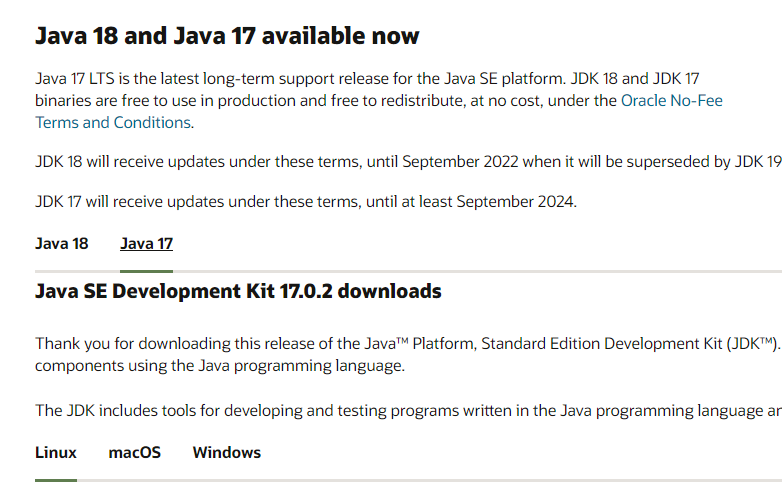

选择与你电脑对应的操作系统

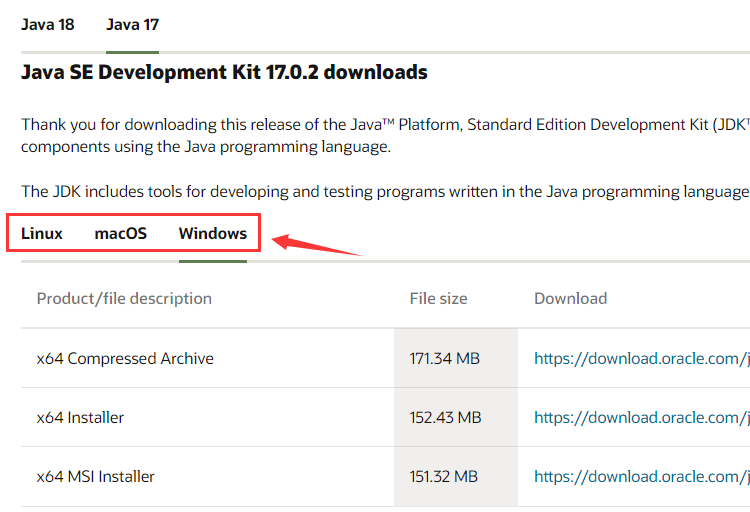

下载压缩包或者安装向导

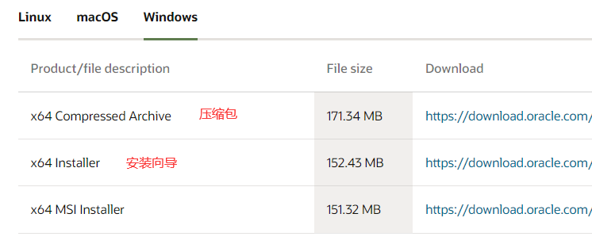

### 1.2 安装

如果下载的是压缩包（直接解压就好），可以跳过这一步，去看设置环境变量

1. 打开Java安装向导

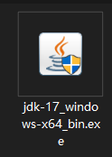

2. 点击下一步

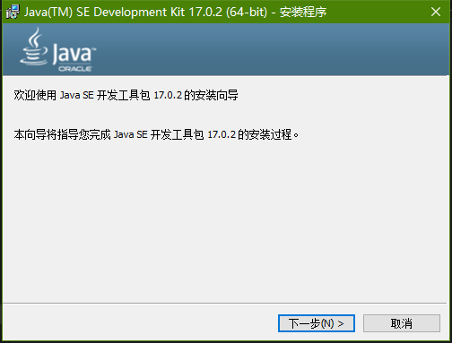

3. 可以更改Java安装路径，也可以保持默认安装路径，==**一定要记住Java安装的路径**==
	然后点击下一步

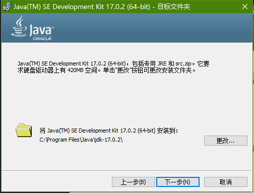

4. 安装完成后，点击关闭

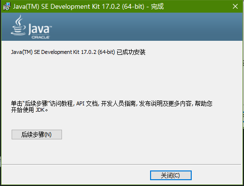

### 1.3 设置环境变量

如果下载的是压缩包，需要手动添加Java环境变量

如果下载的是安装向导，Java环境变量会自动添加，如果没自动添加可以手动添加

1. 在桌面右键单击此电脑，然后点击属性

2. 找到高级系统设置，打开

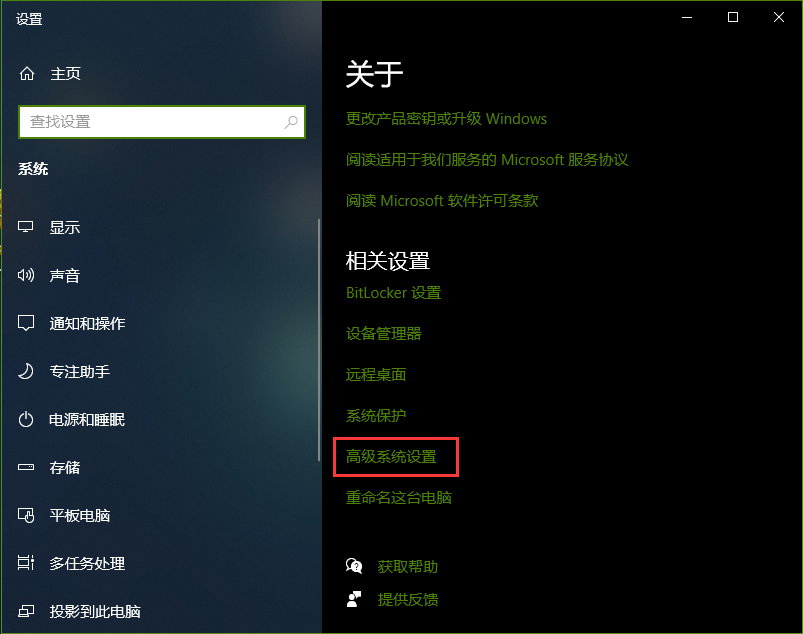

3. 点击环境变量

	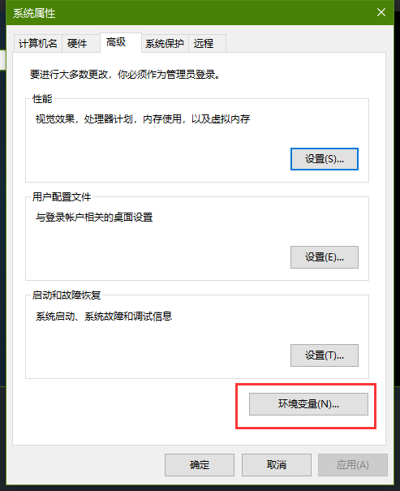

4. 添加Java系统环境变量

	==**Java环境变量要添加到系统环境变量里，而不是用户变量！！**==

	点击新建

	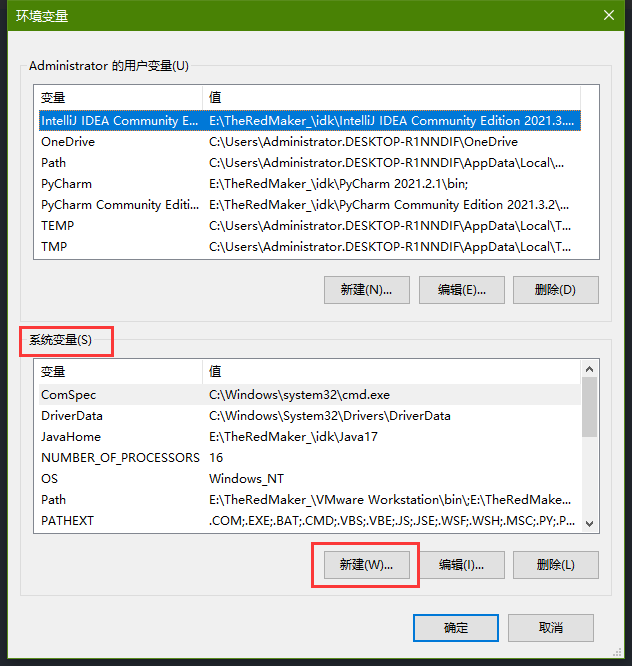
	
	变量名可以随便填写，但是为了方便识别，写上JavaHome
	
	变量值就是Java的安装路径
	
	==**变量值一定要是绝对路径**==
	
	
	
	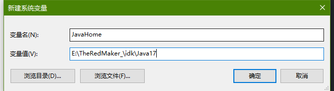
	
	asd

5. asdasd

## 2. HMCL启动器下载，设置启动器，下载Minecraft
