## 教程简介

**本教程作者：TheRedMaker_**

**本教程以Win10操作系统演示**

你将学会怎么使用HMCL启动器游玩Minecraft并且和你的好朋友一起联机

## 目录

1. [Java](#a)

	  - [1.1 下载](#aa)

	  - [1.2 安装](#ab)

	  - [1.3 设置环境变量](#ac)

2. [LittleSkin](#b)
	- [2.1 注册](#ba)
	- [2.2 设置](#bb)
	- [2.3 皮肤，披风](#bc)

3. [HMCL启动器](#c)

	- [3.1 HMCL下载](#ca)

	- [3.2 HMCL添加外置账户](#cb)

	- [3.3 从HMCL上下载Minecraft](#cc)
	- [3.4 管理和设置Minecraft](#cd)

4. HMCL启动器自带的联机功能

5. 内外穿透联机

## 1. Java<i id="a"></i>

**目前我知道Java17可以运行1.12.2 - 1.18.2，我也不知道Java17能不能运行小于1.12.2的Minecraft版本，因为我玩的最低的Minecraft版本是1.12.2，像1.7.10,1.8这些更低的版本我现在都不玩（以前1.12.2还没发布的时候还是玩的），我很少玩低版本（除非想玩一些高版本没有的模组），现在都是在玩高版本：1.18, 1.19**

### 1.1 下载<i id="aa"></i>

下载地址：https://www.oracle.com/java/technologies/downloads/

1. 打开Java下载地址，找到Java17

	

2. 选择与你电脑对应的操作系统

	

3. 下载压缩包或者安装向导

	

### 1.2 安装<i id="ab"></i>

如果下载的是压缩包（直接解压就好），可以跳过这一步，去看设置环境变量

1. 打开Java安装向导

	

2. 点击下一步

	

	

3. 可以更改Java安装路径，也可以保持默认安装路径

	**一定要记住Java安装的路径**

	然后点击下一步

	

4. 安装完成后，点击关闭

	

### 1.3 设置环境变量<i id="ac"></i>

如果下载的是压缩包，需要手动添加Java环境变量

如果下载的是安装向导，Java环境变量会自动添加，如果没自动添加可以手动添加

1. 在桌面右键单击此电脑，然后点击属性

2. 找到高级系统设置，打开

	

3. 点击环境变量

	

4. 添加Java系统环境变量

	**Java环境变量要添加到系统环境变量里，而不是用户变量！！**

	点击新建

	

	变量名可以随便填写，但是为了方便识别，写上JavaHome

	变量值就是Java的安装路径**(一定要是绝对路径)**

	Java安装目录下的文件应该是这样的

	

	设置完成后点击确定

	

	双击打开path

	

	然后点击新建

	输入%JavaHome%\bin

	%JavaHome%就是调用刚刚创建的JavaHome的变量值

	bin是Java安装目录下的一个文件夹

	所以%JavaHome%\bin就是E:\TheRedMaker_\idk\Java17\bin_

	你也可以不用创建JavaHome，直接在path里面新建，然后填写Java安装路径+\bin就可以，如：E:\TheRedMaker_\idk\Java17\bin

	

	然后点击确定（3个窗口都点确定)，Java环境变量就设置好了

5. 检查Java的环境变量是否设置正确

	按下`Win` + `R`打开运行窗口，输入cmd打开命令提示符

	

	输入指令

	```powershell
	java -version
	```

	输出下面图片中的结果就说明Java环境变量设置正确

	

## 2. LittleSkin<i id="b"></i>

### 2.1 注册<i id="ba"></i>

LittleSkin官网：https://littleskin.cn/

打开LittleSkin的官网，注册一个账号

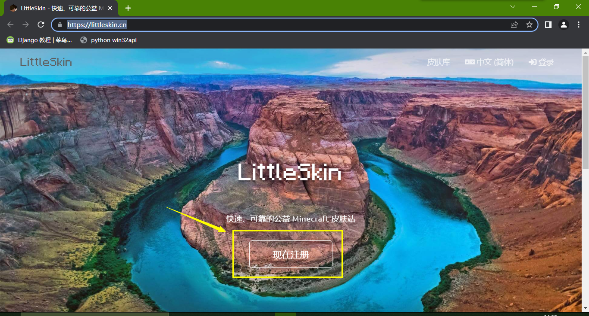

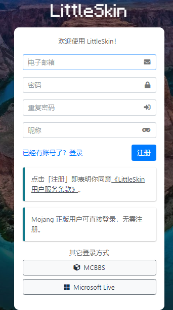

### 2.2 设置<i id="bb"></i>

注册完后，进入仪表盘页面

这里可以签到积分

上传皮肤，资源等，都需要用到积分

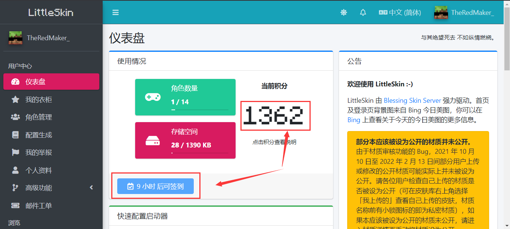

点击角色管理，添加新角色

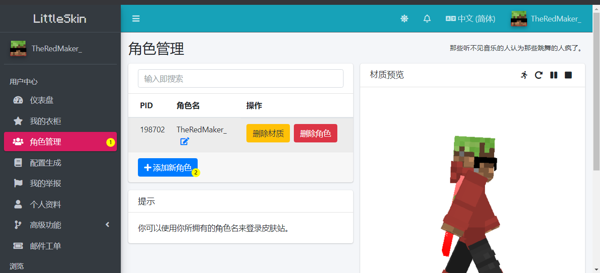

按照提示输入正确的用户名，然后点击确定

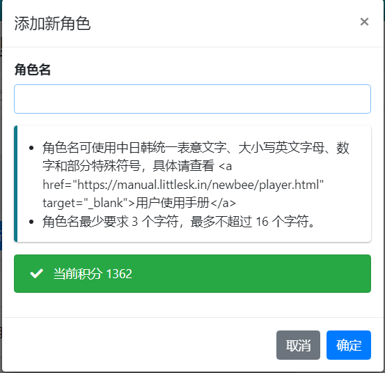

### 2.3 皮肤，披风<i id="bc"></i>

来到我的衣柜，这里可以管理你下载，上传的皮肤或披风

点击上传材质，可以上传你自己的皮肤和披风

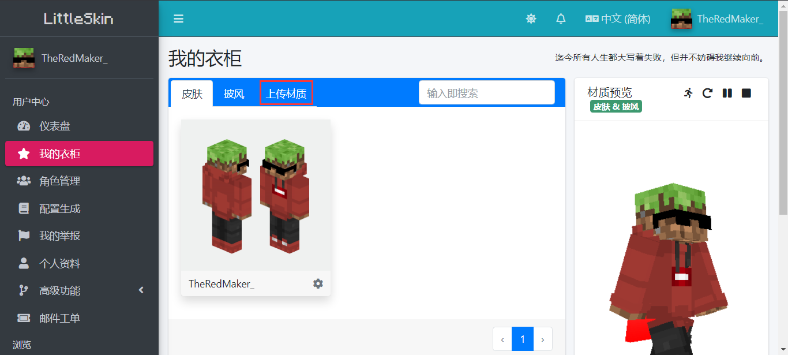

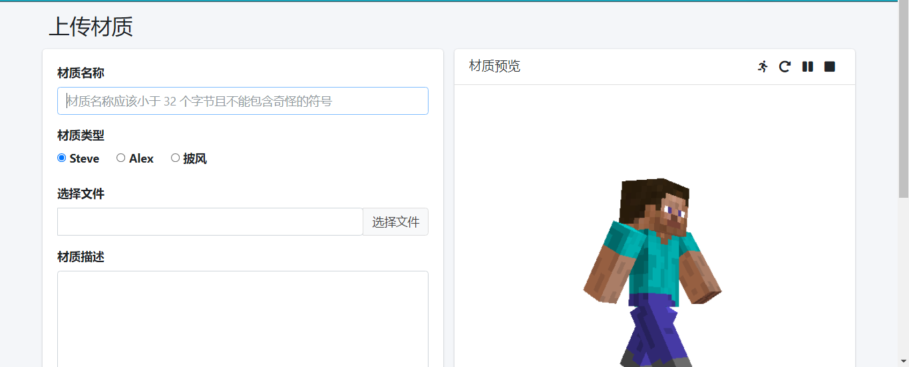

设置为私密材质，勾选后，你上传的材质不会在LittleSkin的皮肤库里面出现，如果不设置为私密材质，你的皮肤就会在皮肤库里面出现，其他的LittleSkin玩家就可以从皮肤库里面下载你上传的皮肤，如果你不想让其他玩家使用你的皮肤，就把皮肤设置成私密材质吧，但这会额外消耗你的积分

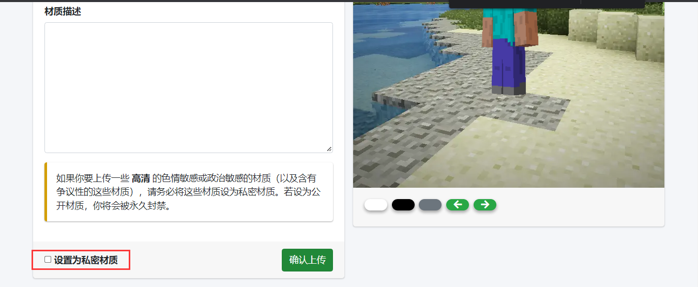

然后来到我的衣柜，点击刚刚上传的皮肤或者披风

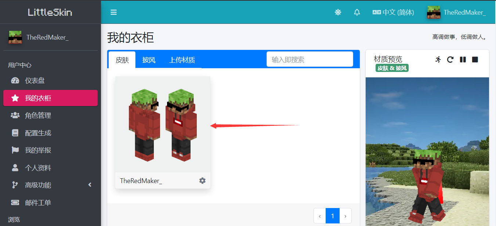

然后点击使用


选择要使用这些材质的角色

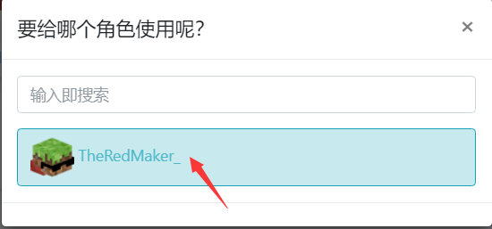

这样你的皮肤，披风就设置好了，其他的LittleSkin玩家和你联机的时候是可以看到你的皮肤的

你也可以从LittleSkind皮肤库里面下载其他玩家上传的皮肤

## 3. HMCL启动器<i id="c"></i>

### 3.1 HMCL下载<i id="ca"></i>

下载地址：http://hmcl.huangyuhui.net/download/

打开下载地址，电脑是什么操作系统就选哪个下载

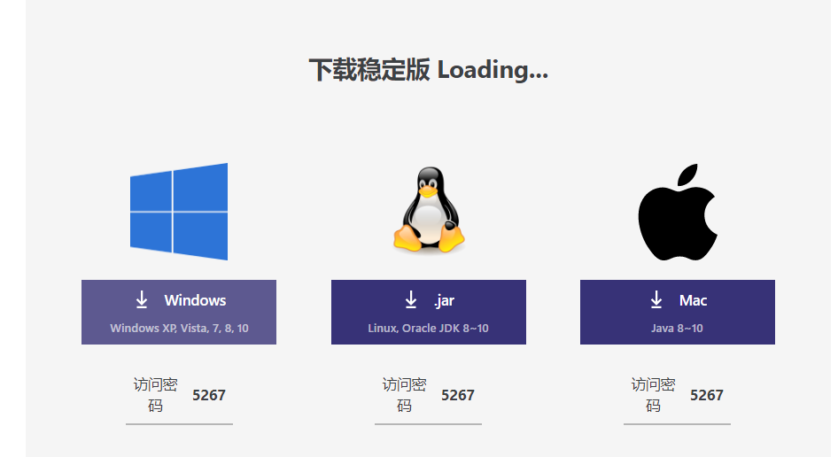

### 3.2 HMCL添加外置账户<i id="cb"></i>

点击这里打开账户管理界面

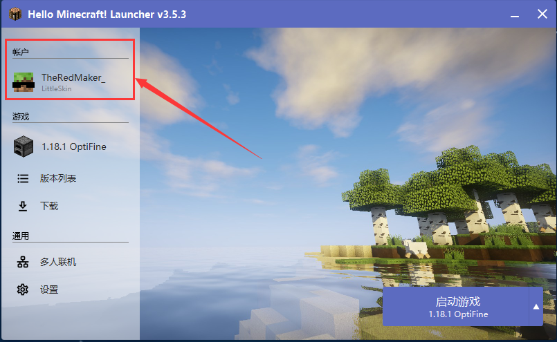

点击添加认证服务器

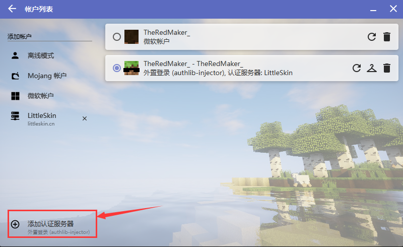

然后填上LittleSkin的认证服务器地址

认证服务器地址在LittleSkin官网仪表盘页面可以找到

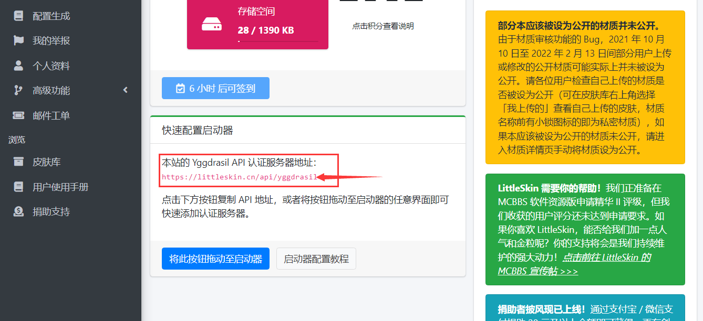

认证服务器地址：https://littleskin.cn/api/yggdrasil

之后点击这里来添加LittleSkin角色

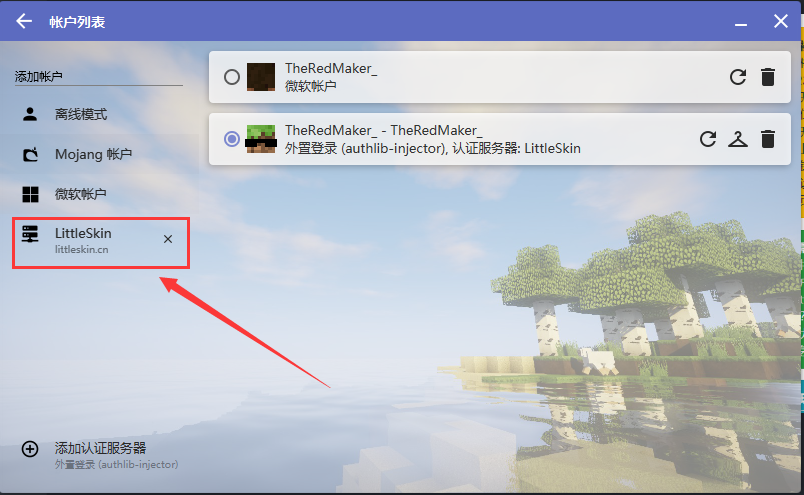

### 3.3 从HMCL上下载Minecraft<i id="cc"></i>

在下载Minecraft前先来看看这些设置

点击打开版本列表

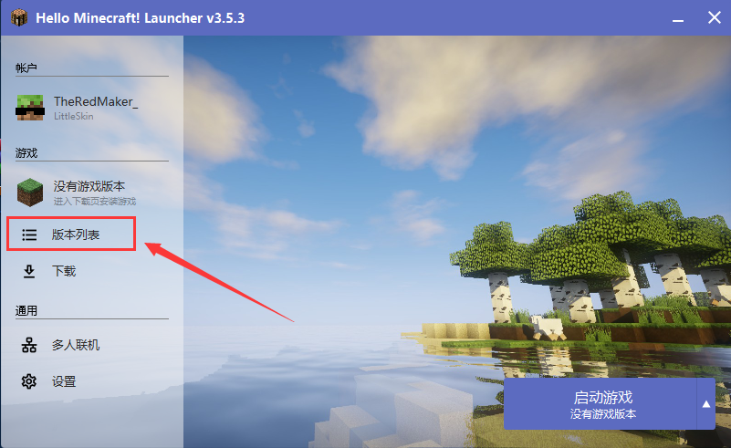

点击添加游戏目录

游戏目录就是，你下载的Minecraft要放到哪里

所以，最好去看一下游戏目录的位置，**最好不要放在系统盘（C盘）**，放在其他盘

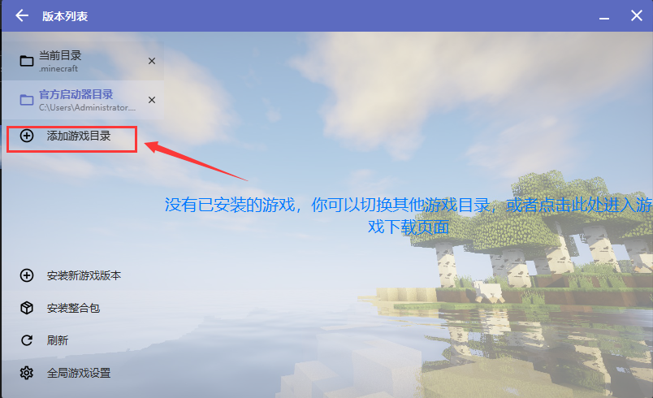


名称可以随便填

名称在这个地方显示

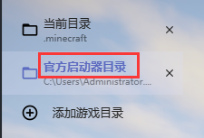

如果你勾选了“若可能，游戏目录使用相对路径”

Minecraft就会放到HMCL启动器所在的目录下面

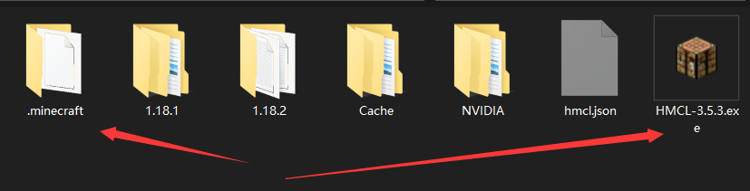

点击打开设置


文件下载缓存目录

换不换都行，默认是在系统盘（C盘）

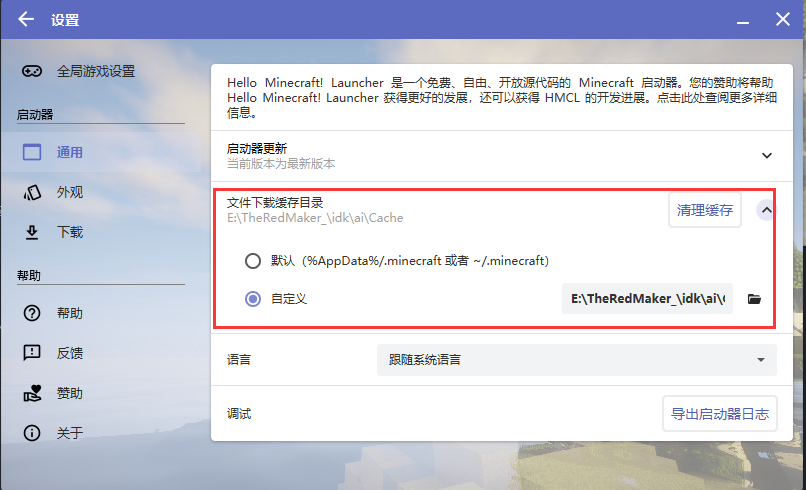

下载源

如果遇到下载失败或者下载速度慢，更换下载源试试

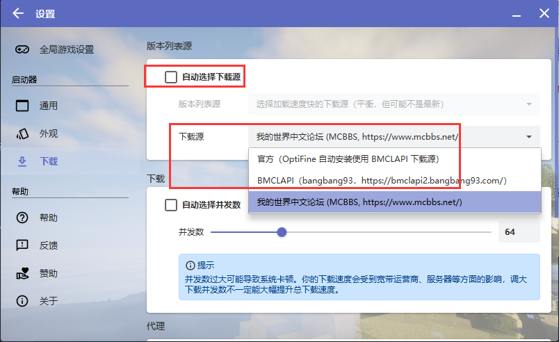

接下来开始下载Minecraft了

点击版本列表


点击安装新游戏版本

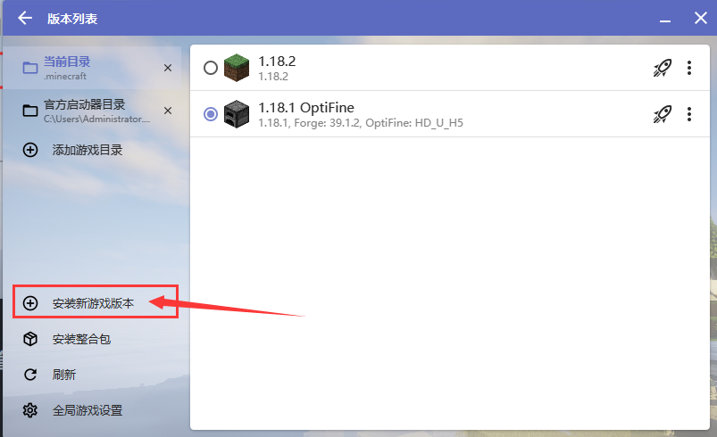

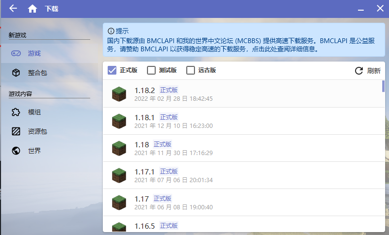

可以安装Forge和Optifine，在这里装的Optifine可以不需要Forge

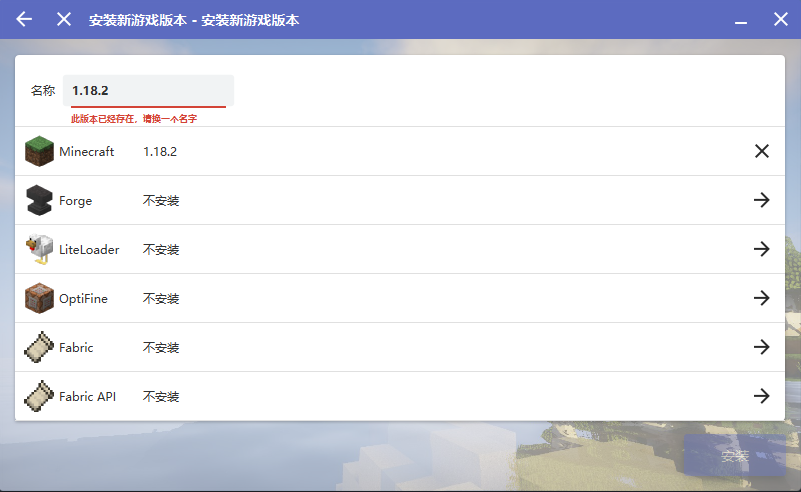

### 3.4 管理和设置Minecraft<i id="cd"></i>

在开始游戏之前，我们还要来看一些重要的设置

点击这里可以管理和设置当前的游戏版本


勾选“启动游戏特定设置”可以单独对这个版本进行设置

**建议你们把每个版本都分开放到一个单独的文件夹，如果不把版本分开放，你的所有版本会使用同一个mods文件夹，材质包文件夹等资源**

**1.12.2的mod，1.18用不吧？**

**HMCL启动器上也说了**

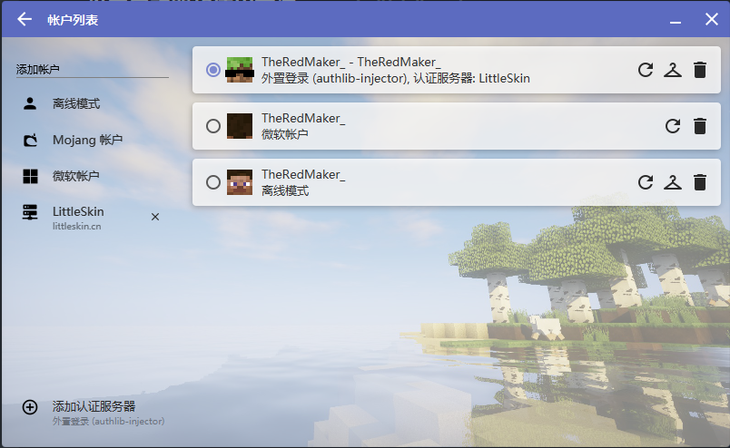

如果你不勾选“启用游戏特定设置”

就会使用全局游戏设置，也就是这里的

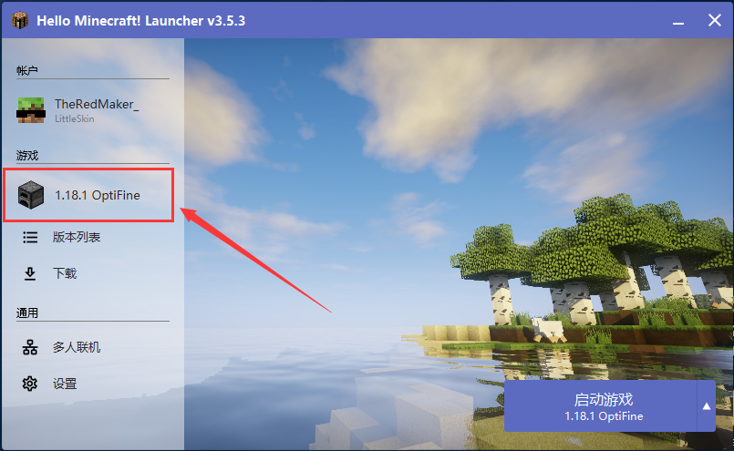
