## 教程简介

**本教程作者：TheRedMaker_**

**本教程以Win10操作系统演示**

你将学会怎么使用HMCL启动器游玩Minecraft并且和你的好朋友一起联机

1. [Java下载，安装，设置环境变量](#a)
	- [下载](#aa)
	- [安装](#ab)
	- [设置环境变量](#ac)

2. [HMCL启动器下载，设置启动器，下载Minecraft](#b)

3. LittleSkin注册，设置，皮肤，披风

4. HMCL启动器自带的联机功能

5. 内外穿透联机

## 1. Java下载，安装，设置环境变量<i id="a"></i>

### 下载<i id="aa"></i>

下载地址：https://www.oracle.com/java/technologies/downloads/

1. 打开Java下载地址，找到Java17

	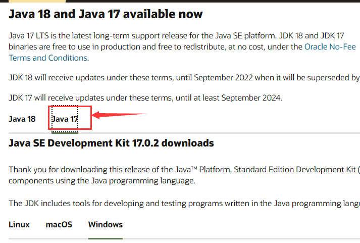

2. 选择与你电脑对应的操作系统

	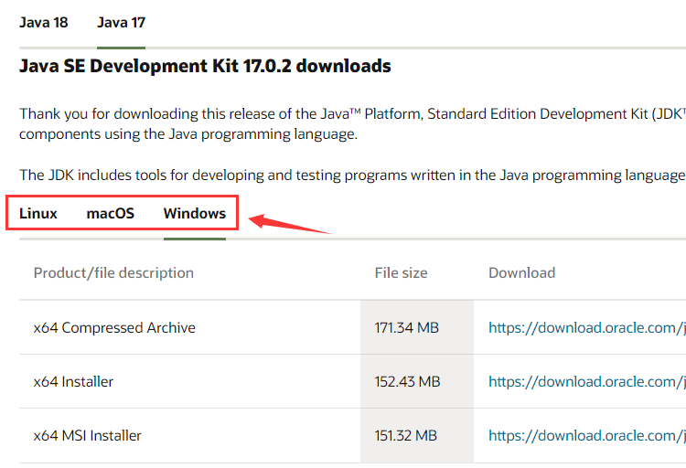

3. 下载压缩包或者安装向导

	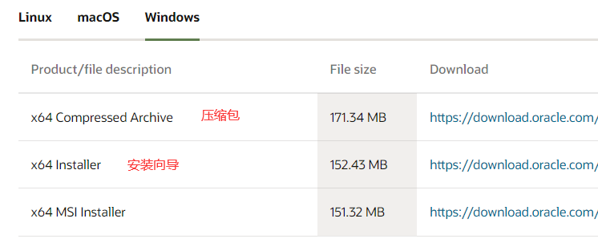

### 安装<i id="ab"></i>

如果下载的是压缩包（直接解压就好），可以跳过这一步，去看设置环境变量

1. 打开Java安装向导

	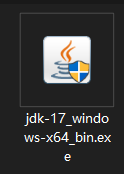

2. 点击下一步

	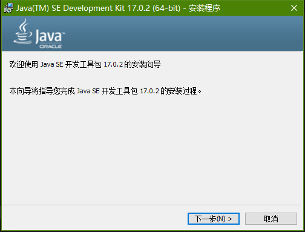

3. 可以更改Java安装路径，也可以保持默认安装路径

	**一定要记住Java安装的路径**

	然后点击下一步

	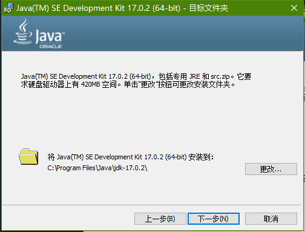

4. 安装完成后，点击关闭

	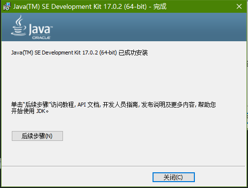

### 设置环境变量<i id="ac"></i>

如果下载的是压缩包，需要手动添加Java环境变量

如果下载的是安装向导，Java环境变量会自动添加，如果没自动添加可以手动添加

1. 在桌面右键单击此电脑，然后点击属性

2. 找到高级系统设置，打开

	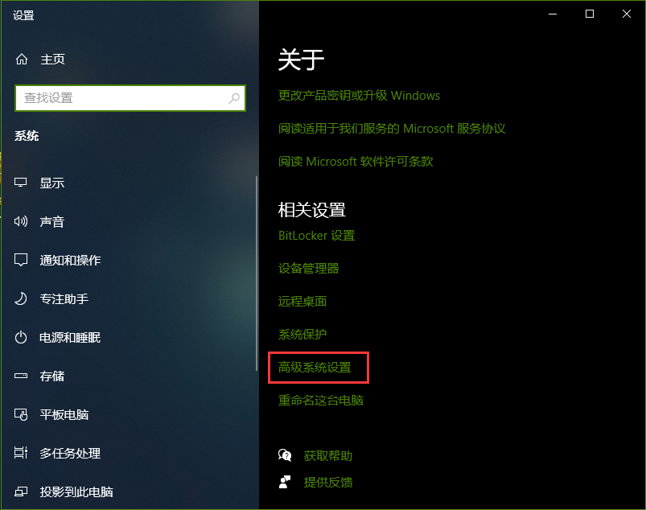

3. 点击环境变量

	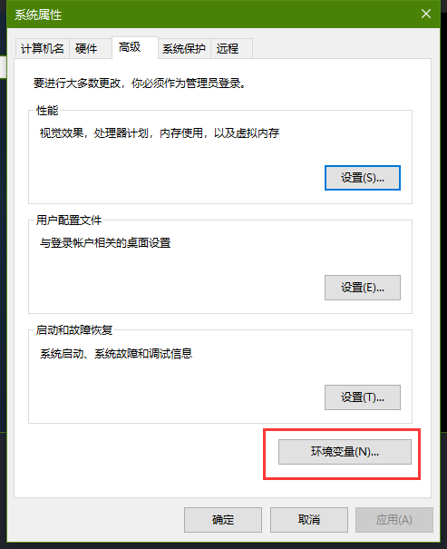

4. 添加Java系统环境变量

  **Java环境变量要添加到系统环境变量里，而不是用户变量！！**

  点击新建

  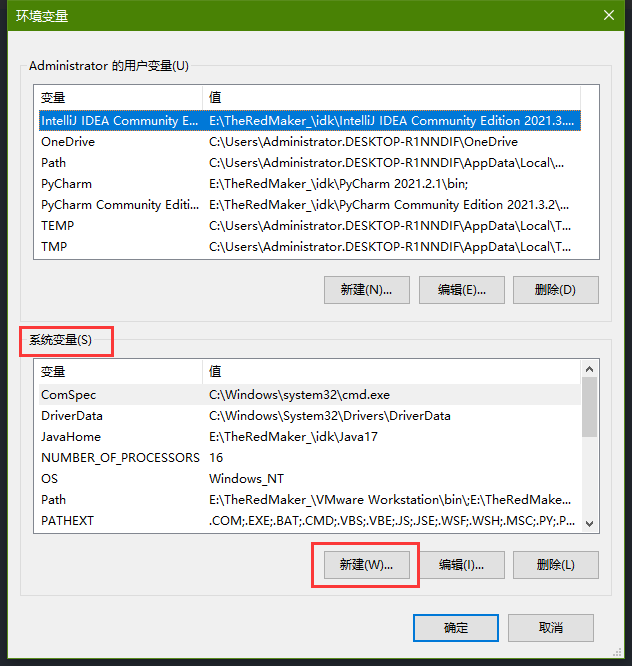

  变量名可以随便填写，但是为了方便识别，写上JavaHome

  变量值就是Java的安装路径**(一定要是绝对路径)**

  Java安装目录下的文件应该是这样的

  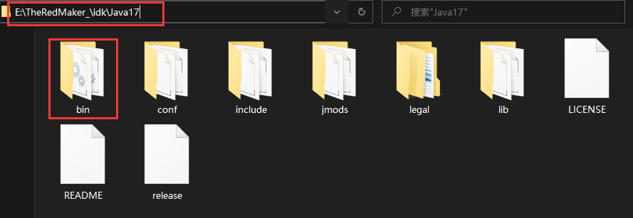

  设置完成后点击确定

  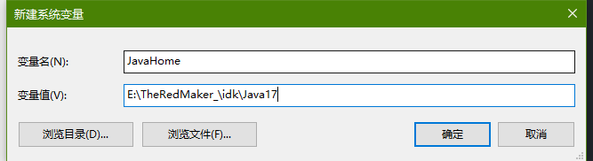

  双击打开path

  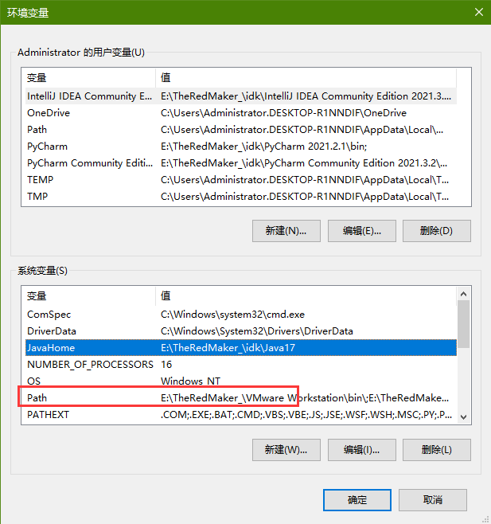

  然后点击新建

  输入%JavaHome%\bin

  %JavaHome%就是调用刚刚创建的JavaHome的变量值

  bin是Java安装目录下的一个文件夹

  所以%JavaHome%\bin就是E:\TheRedMaker_\idk\Java17\bin

  你也可以不用创建JavaHome，直接在path里面新建，然后填写Java安装路径+\bin就可以，如：E:\TheRedMaker_\idk\Java17\bin

  

  然后点击确定（3个窗口都点确定），Java环境变量就设置好了

5. 检查Java的环境变量是否设置正确

  按下`Win` + `R`打开运行窗口，输入cmd打开命令提示符

  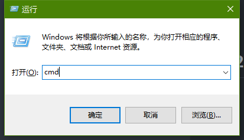

  输入指令

  ```powershell
  java -version
  ```

  输出下面图片的结果就说明Java环境变量设置正确

  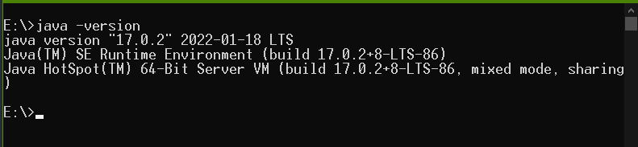

## 2. HMCL启动器下载，设置启动器，下载Minecraft<i id="b"></i>

1. asdasd

	asdasd

	asd

	iiasidi
